  

    I'm passionate about <strong>Data Science</strong>, <strong>Bioinformatics</strong>, and <strong>Artificial Intelligence</strong>. I build reproducible workflows for genomic analysis, data exploration, and machine learning with a strong focus on <strong>SQL</strong>, <strong>database design</strong>, and practical automation.
  

 

## 🚀 About Me

- 🎓 I work on projects related to data science, artificial intelligence, and bioinformatics.
- 🧬 I specialize in genomic data analysis, biological sequence processing, and research-oriented automation.
- 🛠️ Languages I use: **Python**, **R**, **SQL**, **JavaScript**, **TypeScript**, **Rust**, **C#**, and **Bash**.
- 💡 My interests include **Machine Learning**, **Data Analytics**, **Natural Language Processing**, **Database Management**, and **Bioinformatics**.
- 📊 I enjoy designing clean queries, reproducible notebooks, and data pipelines that are easy to maintain.

 

## 🌐 Connect with Me

 

## 📊 GitHub Stats

<!-- GitHub Stats artık dış servislere değil, .github/workflows/metrics.yml ile her gün otomatik üretilip repo'ya commit edilen kendi dosyana bağlı. Rate limit riski yok. Streak kartı ayrı bir, çalışan servis olduğu için korundu. -->

  

 

## 💻 Languages & Tools

### 🛠️ Programming Languages

### 🧬 Bioinformatics & Data Tools

 

## 🧠 Tech Focus

 

## 📂 Featured Projects

### 1. 🧬 Bioinformatics Analysis Project
- Analyzing genomic sequences using Python and BioPython.
- Implementing sequence alignment and pattern recognition algorithms.
- **Tools used:** `BioPython`, `NumPy`, `Pandas`

### 2. 📊 Data Analysis & Visualization Project
- Analyzing and visualizing large datasets using Python and R.
- Focused on data cleaning, analysis, and extracting meaningful insights.
- **Tools used:** `Pandas`, `Matplotlib`, `Seaborn`

### 3. 🤖 Machine Learning Model
- Developed a classification model using Python and Scikit-learn.
- Improved model accuracy through training/test set tuning.
- **Tools used:** `Scikit-learn`, `NumPy`, `Pandas`

### 4. 🗄️ Database Management & SQL Queries
- Analyzed databases with complex SQL queries.
- Focused on database design and optimization techniques.
- **Databases used:** `MySQL`, `PostgreSQL`

 

## 📫 Get in Touch

---

  

